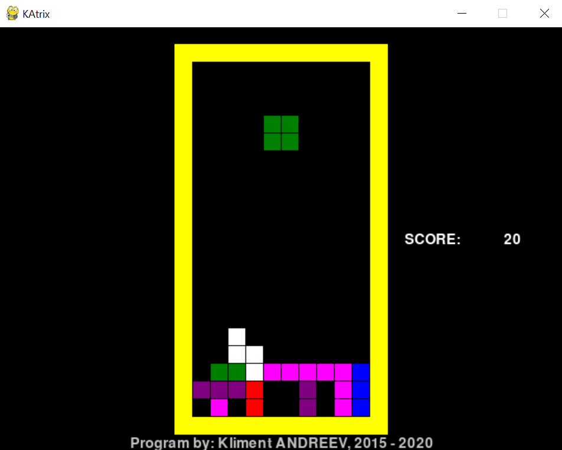

# KAtrix

This is a basic Tetris clone written in Python 3.x and pygame 2.x
The initial version from 2015 was written in Python 2.x, pygame 1.x 
and had a minor bug. The shapes were not falling down automatically too.

5 years later while I was cleaning my Github repo, I made the changes
so the gaming experience is closer to the original.

There are still no different levels and the game runs flat on the same speed. If you want to speed up the game, change the DELAY constant.

Use the cursors to move, SPACE to drop the shape and ESC to exit at any time.

